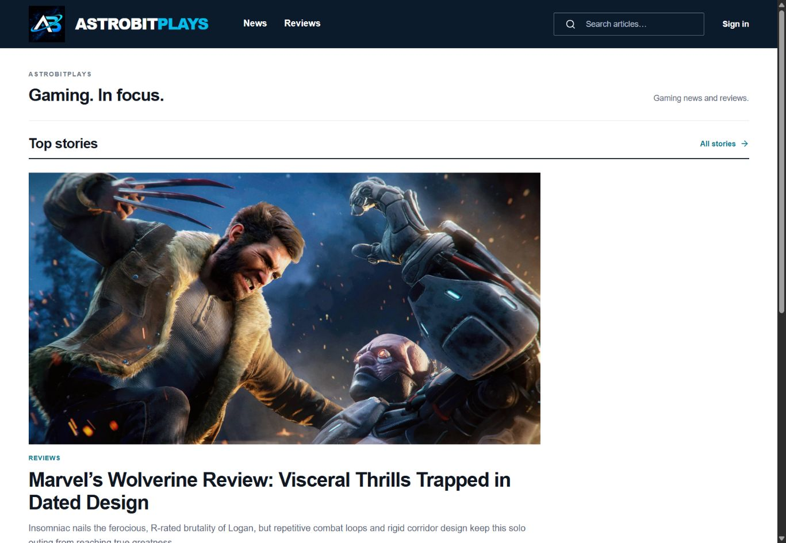
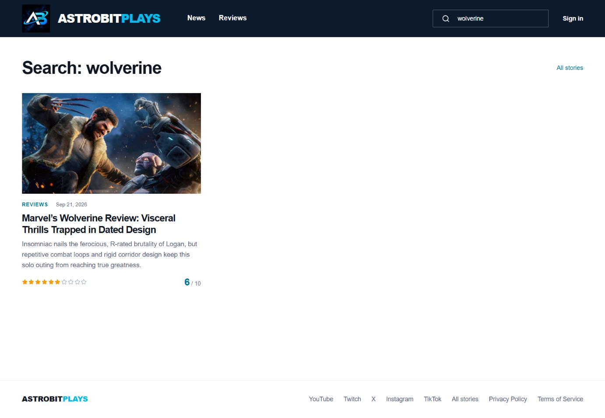
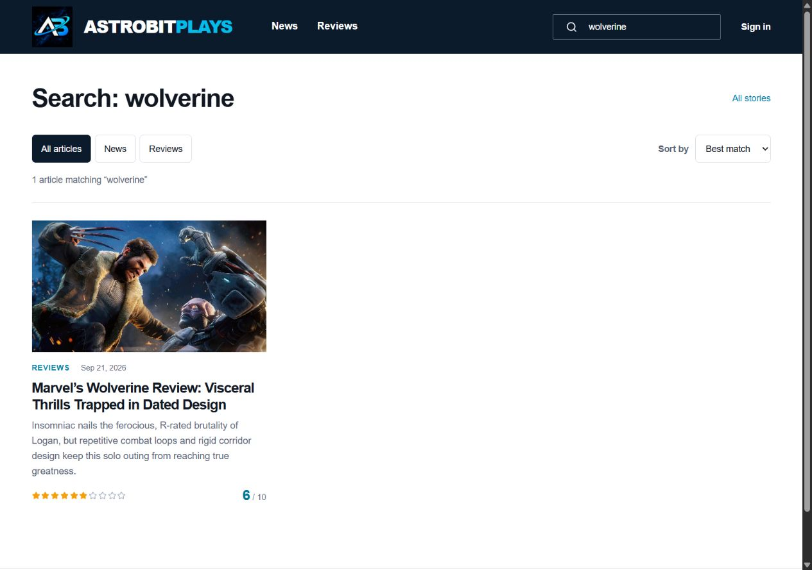
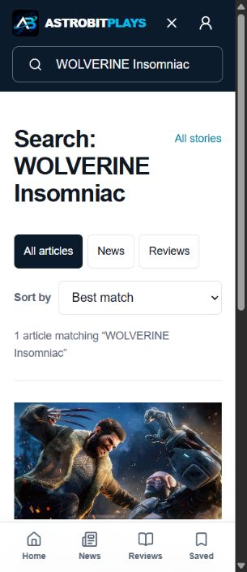
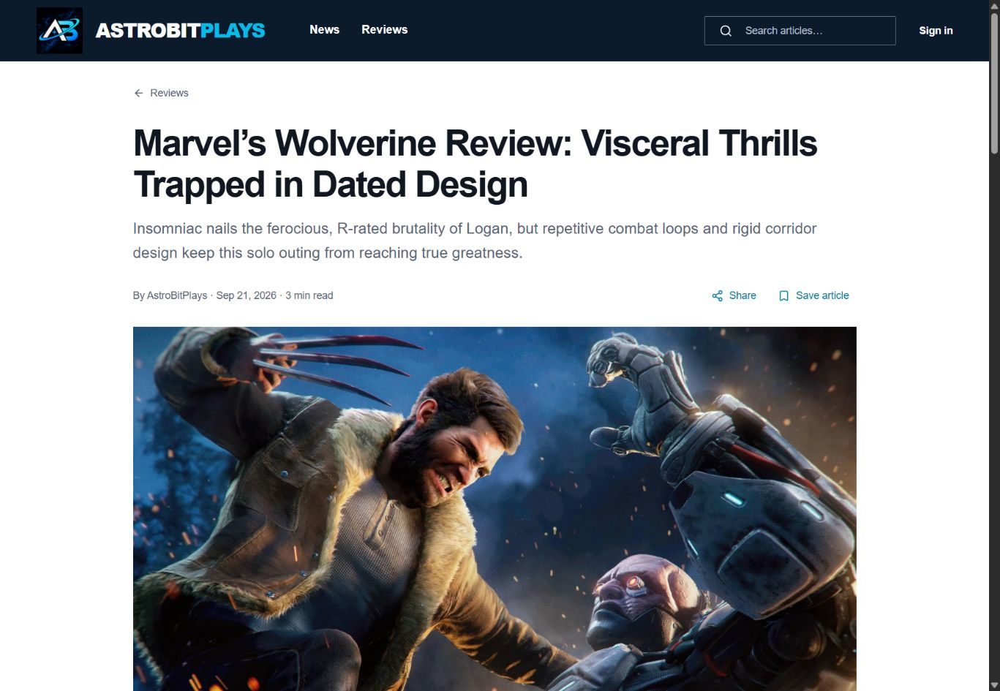
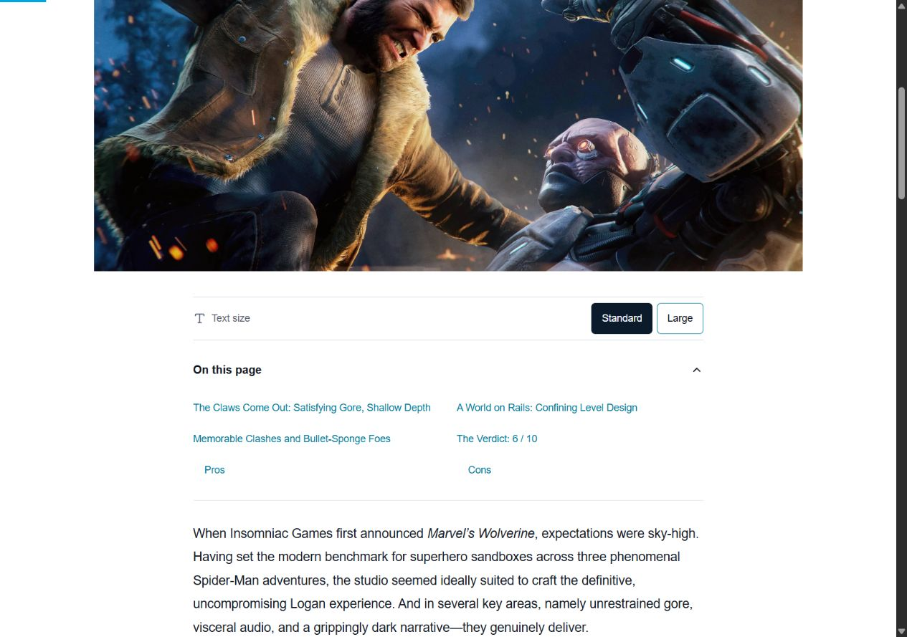
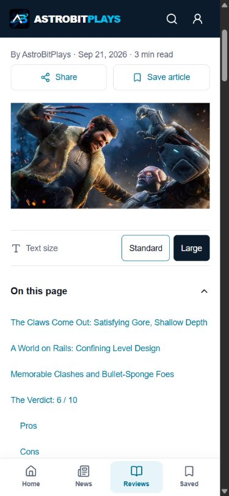

# Reading and discovery improvements — 2 October 2026

Scope: homepage → search → article reading, using current public content in a local browser. The same flow was checked in the production build at desktop, 390px and 320px widths. This is a focused pass toward the broader site-quality goal, not a claim that every site feature or accessibility requirement has been audited.

## 1. Homepage — healthy foundation, more ways to follow

The original homepage has clear brand hierarchy, category navigation and readable story titles. The public feed contained one published story during this run. The design is retained. An RSS link is now available in the footer, with feed autodiscovery in each generated page.

## 2. Search — improved discovery and recovery

Before: a query returned cards with no result count, category control or sort control. Implementation inspection also showed exact substring matching, which missed reordered words and accented variants.

After: title matches rank above summary/body matches; all search words can match across fields; casing, accents and apostrophes are normalized. Category filters and chronological sorting persist in the URL, so readers can refresh or share the same result set. Live result counts make the set understandable. Empty results offer search guidance, category reset and a route back to top stories. The controls retain visible focus and at least 44px height. Narrow phone widths reflow without horizontal page scrolling.

## 3. Article reading — improved navigation and comfort

Before: a long review had multiple headings but no section navigation or text-size choice.

After: an expandable outline links to real headings; duplicate, formatted, Setext and Unicode headings receive consistent unique IDs. Section jumps focus their target and keep it clear of the mobile header. The text column stays constrained while the Large option increases body text to 21px; the preference persists after reload. Readers can also switch between light and dark themes, with the choice remembered on the device. Reading progress tracks the body, excluding the mobile bottom-navigation area, without causing React renders during scrolling. A Continue reading prompt can restore a saved position on the device, or start the article over. Changing text size preserves the rendered Markdown and media. A Back to top link returns to the title. Print rules remove navigation and reader controls.

## Verification and limits

- 22 automated tests cover database ownership, deletion cleanup, publication visibility, Markdown safety, outline/anchor agreement, fragment links, reading geometry, search ranking and filters, and RSS privacy/escaping/order/identity.
- TypeScript, lint and the production build pass. The production article hydrated without reported browser errors. Phone checks confirmed no horizontal overflow, live filtering, section focus and remembered text size.
- Article and feed requests now start concurrently; stalled content requests have a timeout and a visible retry action. Reader code remains a separate lazy-loaded module. This proves the implementation behavior, not a measured network speedup or a Core Web Vitals score.
- RSS is served as valid XML from the built site and includes only the latest 50 due, published News/Reviews entries. Drafts, scheduled content and private reader data are excluded. It refreshes with the existing content-deployment schedule.
- Signed-in bookmark and owner flows were not exercised through a live account during this pass. Screen-reader speech, native device sharing and print output were not manually tested. No full WCAG compliance claim is made.
- The prior post-deletion migration still requires database-side application; this pass adds no new database migrations.

## Next improvements toward the full goal

Prioritize measured image and loading performance, richer topic-based discovery as the archive grows, and account/reading-list usability. Server-side indexed search should replace browser-wide full-body search when the content volume warrants it. Validate those decisions with current performance and reader-flow evidence before implementing them.
