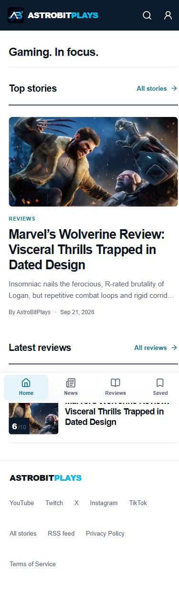
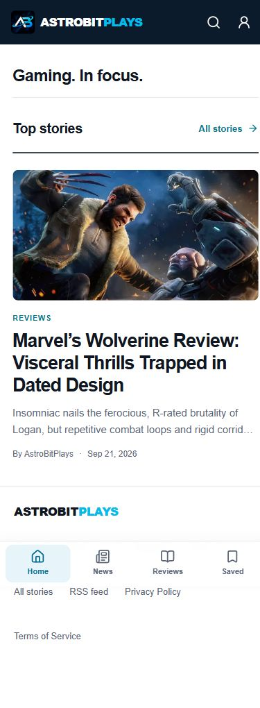
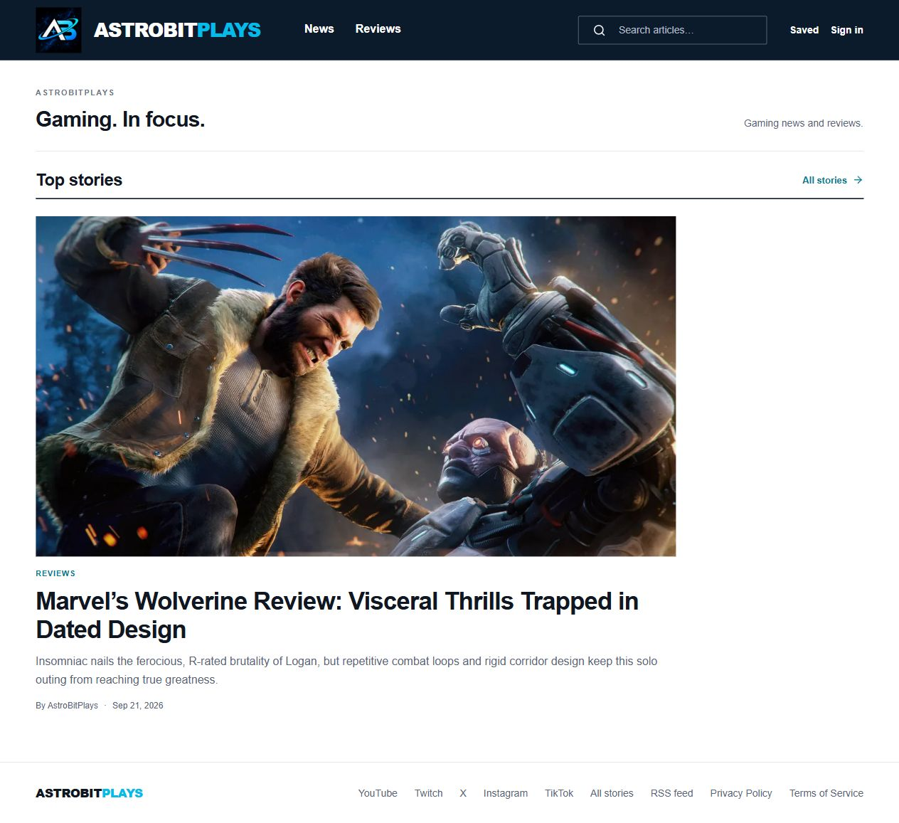
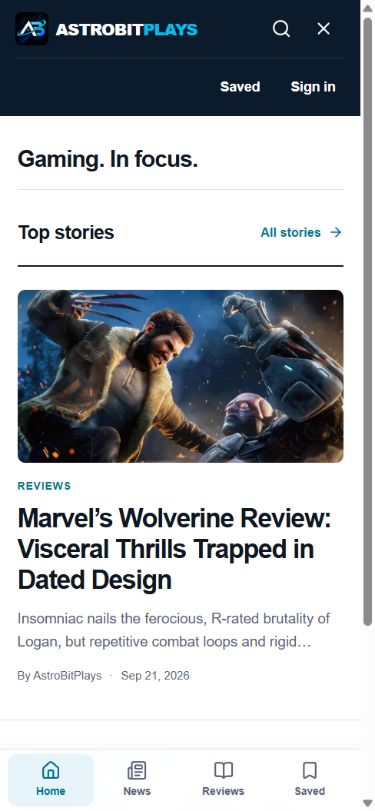

# Cover delivery and reading lists

Reviewed October 2, 2026 against the live site and the production build at `http://127.0.0.1:4173/`.

## Journey and health

1. **Open a story — improved.** The current cover was a 3,339 × 1,878 JPEG weighing 1,236,328 bytes. The build now produces proportional WebP candidates and the browser chooses a size for the screen. The existing layout and editorial images are preserved.
2. **Save for later — improved.** Previously, Save article opened a sign-in dialog. Readers can now save on their device immediately; sign-in and importing those saves into an account are explicit choices.
3. **Manage the reading list — improved.** Saved articles survive reloads, can be removed from the list, and offer Undo. Category filters, counts, sorting, and a clear filtered empty state work on desktop and phones. Failed account loading offers Retry.
4. **Watch a video — improved.** Video cards no longer create YouTube frames or request poster images on page load. A descriptive Play button loads one player after the reader asks, transfers keyboard focus into it, and offers a Close control that unloads the player and returns focus. A direct YouTube link remains available at every stage.
5. **Scan the homepage — improved.** The live publication currently has one story. It appeared as the top story and then immediately reappeared under Latest reviews. The category sections now show stories left after the top-story selection, and empty sections do not render. The story archive and category links still lead to the full feed.
6. **Search the archive — payload improvement prepared.** Search can now use a weighted, accent-insensitive PostgreSQL index and return only matching story summaries. This avoids downloading all article bodies for each search. The frontend keeps its prior search path until the new database migration is applied.

## Evidence

| Cover candidate | Bytes | Reduction from original |
| --- | ---: | ---: |
| 320 px | 10,720 | 99.1% |
| 640 px | 29,562 | 97.6% |
| 960 px | 56,220 | 95.5% |
| 1,280 px | 88,110 | 92.9% |
| 1,920 px | 174,102 | 85.9% |

These are file-size reductions for the current cover, not measured changes in loading time or Core Web Vitals. Browser inspection confirmed local generated candidates: 1,280 px for the desktop article, 640 px for a 390 px reading-list view, and 320 px for the homepage at 320 px. No horizontal overflow was observed at either phone width; no application warning or error was captured during the local flow.

## Verification and limits

- The 32-test suite passed in the video-player pass, along with lint and a full production build. Tests cover malformed storage, persistence failure, duplicate saves, import eligibility, account isolation, responsive rendering, image host restrictions, proportional conversion, and small images that must not be enlarged. The homepage filtering change received a fresh production build and visual check.
- Browser checks covered guest save, reload, remove, Undo, category filtering, optional sign-in, and 390 px / 320 px layouts. Account import was checked through helper and database policy tests; it was not exercised against a live signed-in account.
- Video cards were checked before activation, after keyboard activation, and after Close. Before activation there were zero YouTube frames and zero YouTube thumbnail images. Enter loaded one player and focused the frame; Close removed it and returned focus. At 390 px the stage measures 339 × 191 px, at 320 px it measures 269 × 151 px; neither page scrolls horizontally. These DOM checks verify requests initiated by embed elements, not every browser background request.
- A captured live mobile homepage showed its only story repeated directly under Latest reviews. The rebuilt page displays one feature, zero duplicate category cards and no blank category heading. At 390 px and desktop 1280 px the page has no horizontal overflow; the story and category/archive links remain available.
- On a 390 px viewport, opening the account panel places focus on Saved and shows a close icon. Escape closes the panel and returns focus to its toggle. Escape also closes mobile search and returns focus to its toggle. Neither panel causes horizontal overflow.
- Covers are processed only from the configured public Supabase cover bucket and the current external provider. Downloads have redirect, time, byte, MIME, and decoded-pixel limits. Unsupported or failed conversions retain the original image with a placeholder fallback.
- Device storage can be blocked or cleared by the reader's browser. The UI reports when a save only lasts for the current visit. Account import preserves device saves on failure and ignores existing account duplicates.
- The earlier owner-only post-deletion database migration still needs to be applied to the live Supabase project; this pass does not apply it.
- The indexed-search migration was added on 3 October 2026. The production project has not been confirmed on this migration, so live search still depends on its current database setup. The compatibility path remains available until the migration is applied.

Next candidates: apply the owner-only deletion and indexed-search migrations to the live database, then measure search payloads against a larger archive and improve related-story recommendations as content grows.
